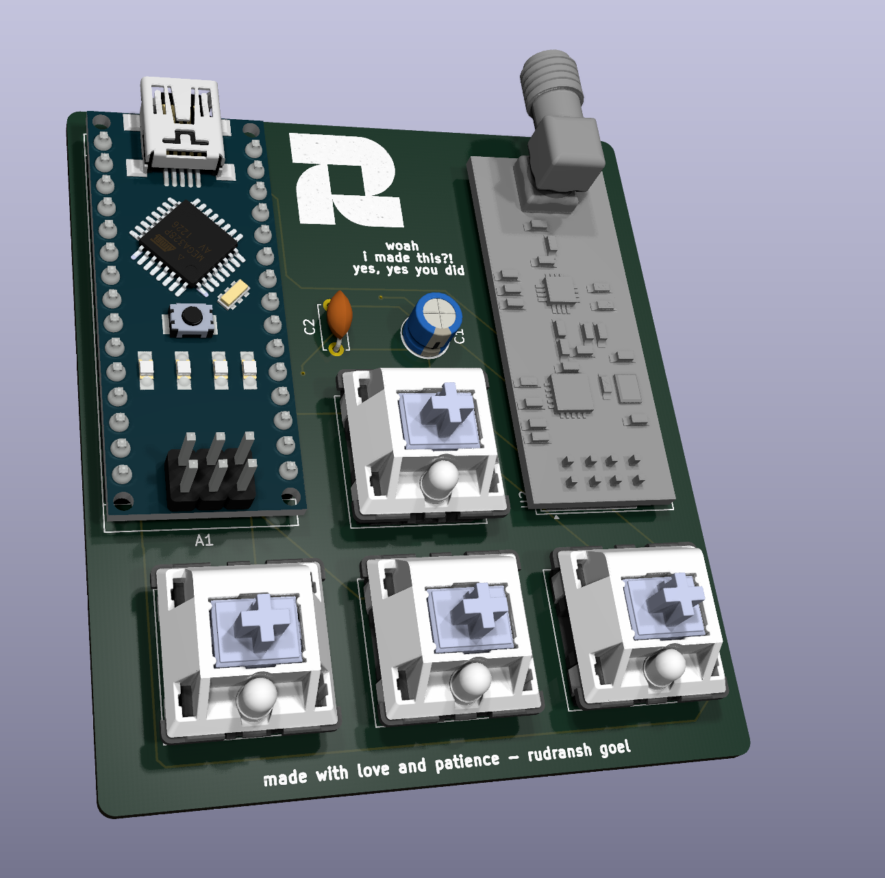
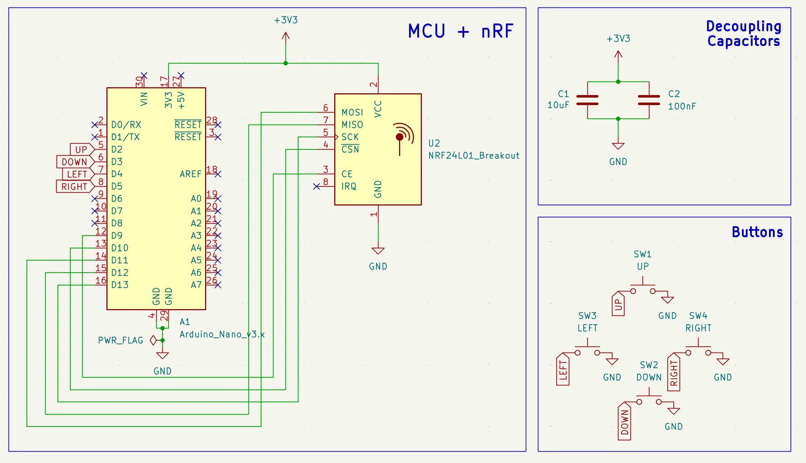
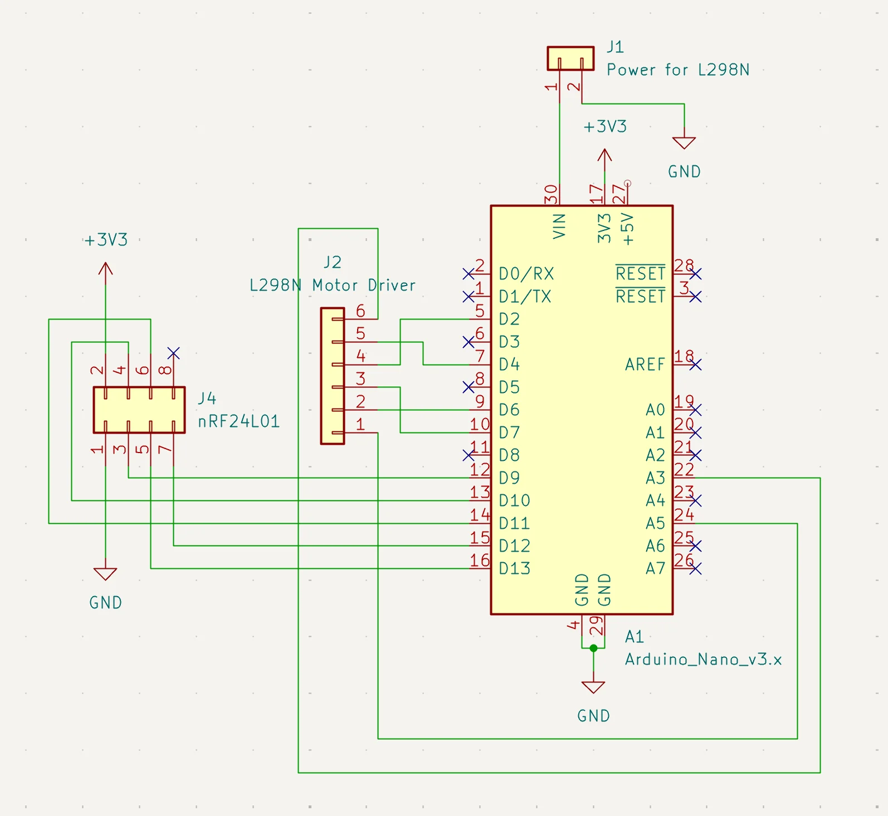
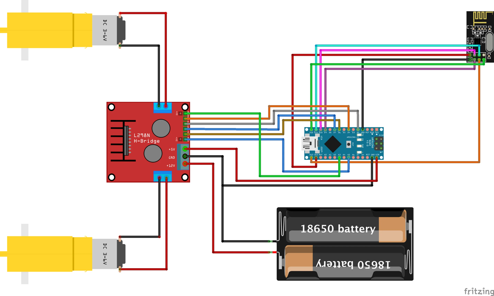
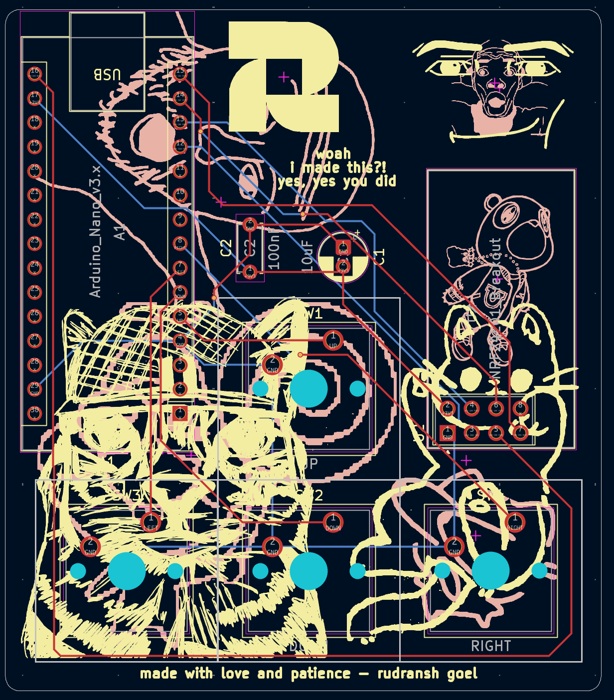
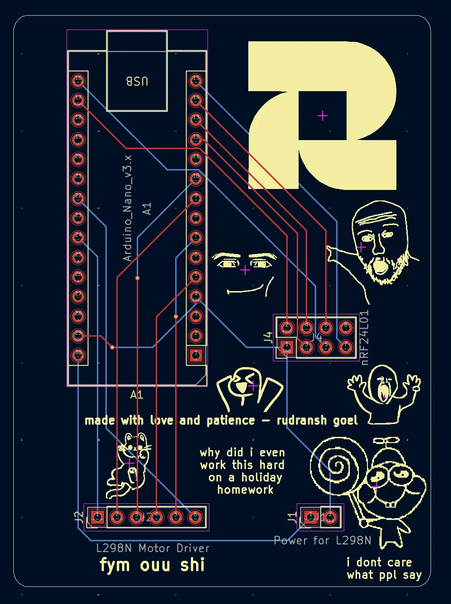
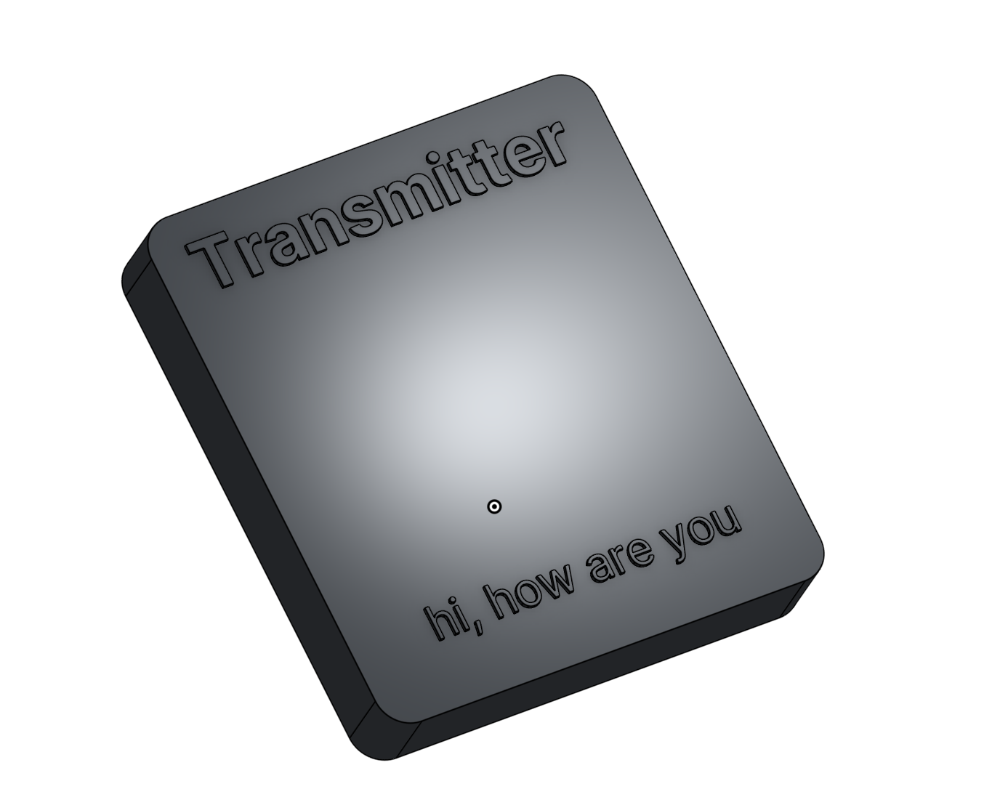
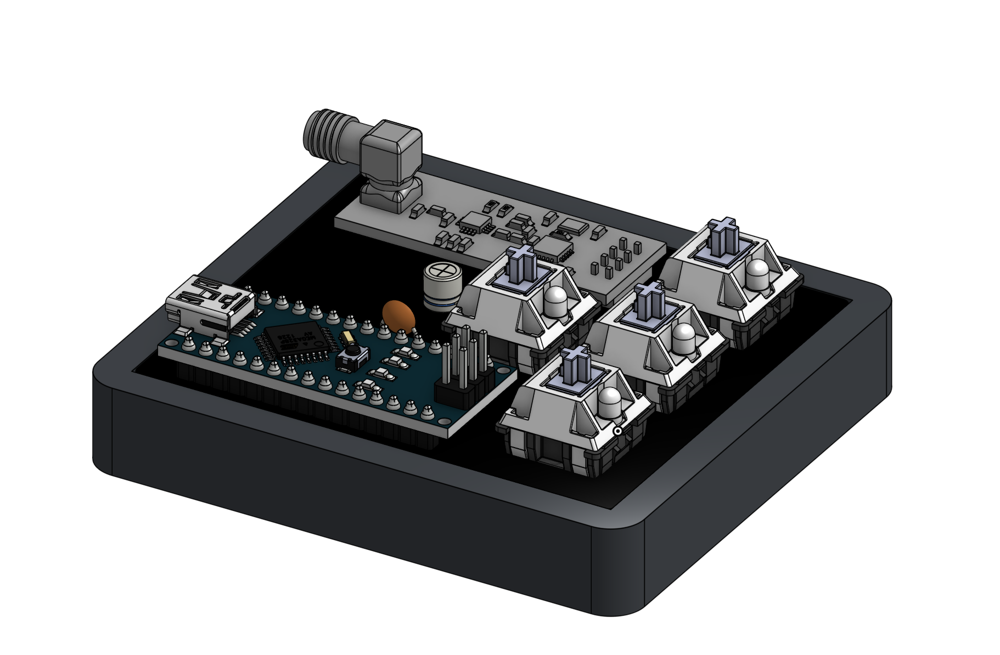
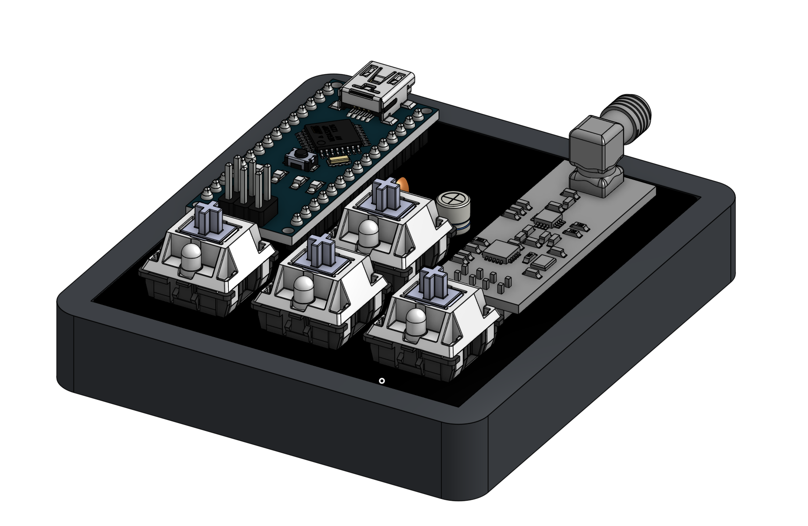

# Wireless RC Car

### Why did I make it?
bcz i need more hardware projects in my portfolio and also because it seemed like a fun hardware project which was kinda beginner friendly.

### What was the hardest part about this ?
schematic and choosing the pcb art. i really did wake up the creative side of me

Features:

- 4 Arrow Keys for controlling the car
- Arduino Nano for the Main MCU
- L298N Motor Driver
- DC Motors + Wheels
- Custom PCB Art (really cool)
- Custom case

### Schematic

### PCB 

### Case

### 3D view of all parts 

link to full 3d thing-
https://cad.onshape.com/documents/55362c062752c5dd0b9c506b/w/202d1c84392a58531153413c/e/98ba119ae289950db80c791d?renderMode=0&uiState=6a291872275c9443df0429f0

A special thanks to Anay and Shadow who are helping me to make my projects better. Love them so much!

## BOM

[BOM](BOM.csv)

|Name                           |Purpose                            |Quantity|Total Cost (USD)|Link                                        |Distributor    |
|-------------------------------|-----------------------------------|--------|----------------|--------------------------------------------|---------------|
|Arduino Nano                   |Arduino Nano as the MCU            |2       |7.6             |https://www.amazon.in/gp/product/B077TJ8FCF/|Amazon         |
|NRF24L01 Transceiver Module    |Tranceiver module                  |1       |2.5             |https://www.amazon.in/gp/product/B073Q2W112/|Amazon         |
|NRF24L01 Transmitter Module    |Transmitter module                 |1       |2.8             |https://www.amazon.in/gp/product/B0H425R413/|Amazon         |
|Switches for Transmitter       |Switches for controlling the car   |4       |0               |SELF SOURCED                                |SELF SOURCED   |
|Keycaps for the swiches        |Keycaps of the switches            |4       |0               |SELF SOURCED                                |SELF SOURCED   |
|100nF Capacitor                |100nF Capacitor                    |1       |1.3             |https://www.amazon.in/gp/product/B0FCFYSP35/|Amazon         |
|10uF Capacitor                 |10uF Capacitor                     |1       |1.6             |https://www.amazon.in/gp/product/B0GKVJ5FXC/|Amazon         |
|PCB of Transmitter AND Receiver|Main PCBs                          |5 + 5   |16.84           |https://jlcpcb.com/                         |JLPCB          |
|L298N Motor Driver             |Motor which controls the wheels    |1       |2.1             |https://www.amazon.in/gp/product/B00N4KWYDE/|Amazon         |
|DC Motors + Wheels             |DC Motors + Wheels for the car     |1       |4.2             |https://www.amazon.in/gp/product/B07Q22QS3R/|Amazon         |
|Case                           |Shipping - Case for the transmitter|1       |5               |                                            |Printing Legion|
|                               |                                   |        |                |                                            |               |
|                               |                                   |        |43.94           |                                            |               |

Final Price comes out to be 4,185 INR ($43.94)

## Shipping
Amazon = ~$2
Printing Legion = ~$5

Total Shipping = $7

## Total Pricing
The total price comes out to be 4,850 INR ($50.94) [ SHIPPING INCLUDED ]
Total Shipping = $7

The pricing might slightly vary due to flash sales, and dollar market trends.